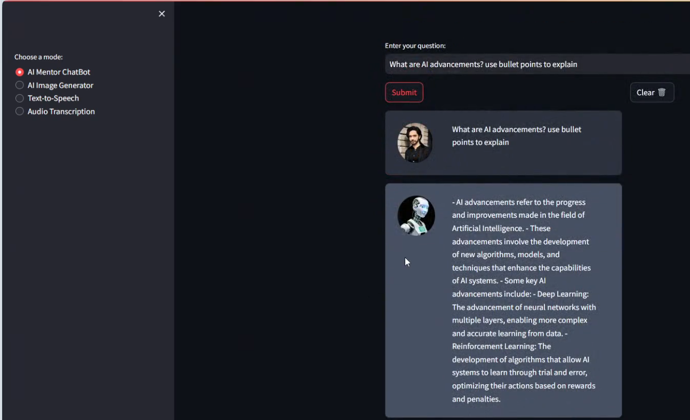

## **🚀 I'm happy to share my latest project: Tosief's AI Maestro 🤖✨ **

**An innovative application built to enhance interactions with AI through chat, visualization, speech, and transcription functionalities.**

**Key Features:**

**🗨️ AI Mentor ChatBot:** Engage with an **AI** that not only converses but educates on **AI and machine learning** topics, tailored to assist students and enthusiasts alike.

**🎨 AI Image Generator:** Watch as your **ideas** turn into **visuals** right before your eyes!

**🗣️ Text-to-Speech:** Bring **text** to life with high-quality **voice outputs**.

**📝 Audio Transcription:** Convert your **audio files** into **text in multiple languages**, including **English and Urdu**.

This application leverages the power of **OpenAI's models**, integrated within a sleek **Streamlit interface**, making it user-friendly and highly interactive.

I've poured my expertise into creating a platform that not only meets the needs of users but also pushes the boundaries of what's possible with **AI integrations** today.

👀 Also, **don't miss out** on seeing the application in action. See the **Snapshots** below! 📸

## **Snapshot of Application Code**
### **This image showcases the backend code in an integrated development environment (IDE), displaying the Python function responsible for image generation in the "Tosief's AI Maestro" application. It highlights the seamless integration of the OpenAI API for generating images based on user input.**

## **Initial Interface of AI Maestro**
### **The initial user interface of "Tosief's AI Maestro" on Streamlit, featuring mode selection options that include AI Mentor ChatBot, AI Image Generator, Text-to-Speech, and Audio Transcription. This snapshot emphasizes the user-friendly design and interactive capabilities of the application.**

## **ChatBot Interaction Interface**
### **This image captures a live interaction with the AI Mentor ChatBot, where the AI provides bullet-point explanations on AI advancements. The interface maintains a clean and engaging layout, facilitating educational and informative conversations.**

## **AI Image Generator in Action**
### **A demonstration of the AI Image Generator feature within the application, showing a generated image of Egyptian pyramids. This snapshot illustrates the application's capability to visually interpret and render user queries into related imagery.**

## **Text-to-Speech Conversion Interface**
### **This image highlights the Text-to-Speech functionality of the application, showing the interface where users can input text to be converted into spoken audio. It showcases the app's ability to transform text into audible speech, enhancing accessibility and user interaction.**

## **Audio Transcription Feature**
### **The final image displays the Audio Transcription interface, where users can upload audio files to be transcribed into text. This feature supports multiple languages, exemplifying the application's inclusivity and versatility in handling diverse user needs.**

